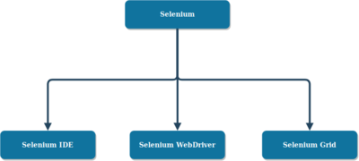
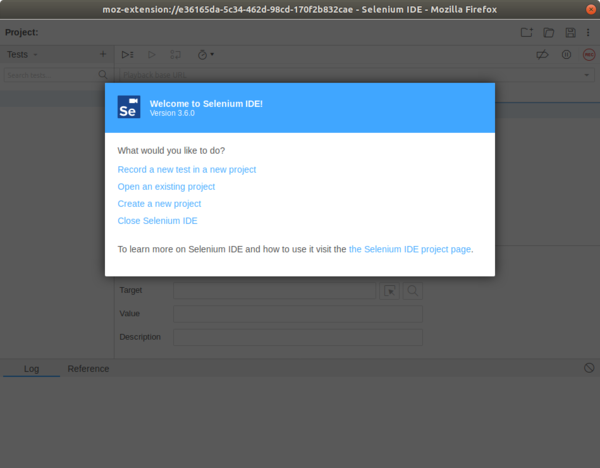
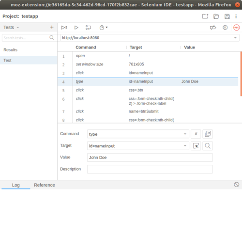
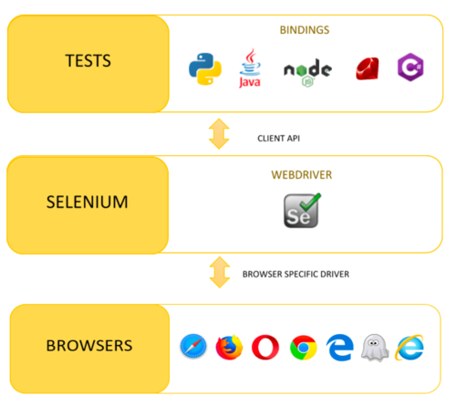

class: inverse, center, middle

# Felületi tesztelés Seleniummal

---

## Selenium

* Böngésző automatizálás, tipikusan webes alkalmazások tesztelésére
* Eszközkészlet, több eszközből áll


---

## Selenium tulajdonságai

* Platformfüggetlen (Windows, Apple OS X, Linux, pl. Ubuntu)
* Képes meghajtani a különböző böngészőket is (Firefox, Internet Explorer, Safari, Opera, Chrome)
* Nyílt forráskódú, ingyenes


---

## Felhasználási területek

* Funkcionális tesztelés
* GUI tesztelés
* Regressziós tesztelés
* Böngészőfüggetlenség tesztelése


---

## Eszközök

* Selenium IDE: felvétel és visszajátszás grafikus felületen
* Selenium WebDriver: böngészővezérlés (pl. programozási nyelvekből API-n keresztül)
* Selenium Grid: automatizált tesztelés több gépről, összehangoltan



---

## Selenium IDE

* Felvétel és visszajátszás (tesztesetek lépésekkel)
* Chrome vagy FireFox Add-On
* Programozási nyelv funkciók: parancskészlet, paraméterezés, változók, vezérlési elemek
* IDE funkciók, pl. projektkezelés, autocomplete, debug
* Parancssori futtatási lehetőség

---

## Selenium telepítése (gyakorlat)

* https://addons.mozilla.org/en-US/firefox/addon/selenium-ide/
* https://chrome.google.com/webstore/detail/selenium-ide/mooikfkahbdckldjjndioackbalphokd

---

## Selenium IDE indítása

* Új projekt létrehozása, és felvétel
* Létező projekt megnyitása
* Új projekt létrehozása
* Selenium IDE bezárása

---

##  Welcome screen



---

## Első teszt felvétele és visszajátszása (gyakorlat)

* http://tadev.training360.com/testapp-web
* Egy teszt végigvitele: `Answer questions`
* Eredmény ellenőrzése: Jobb klikk/Selenium IDE/Assert text

---

## Selenium IDE képernyő



---

## Futtatás

* Base URL
* Run all tests
* Run current test
* Execution speed
* Log ablak

---

## Debug

* Breakpoints (Toggle breakpoint - `B`)
* Disable all breakpoints
* Stop test execution
* Resume test execution
* Play to this point
* Play from here

---

## Fájlkezelés

* Project név
* Create new project
* Open project
* Save project

---

## Tesztek szervezése

* Tests (test cases)
  * Rename, Duplicate, Delete, Export
* Test suites
  * Add tests, Rename, Delete, Settings, Export
* Executing

---

## Új teszt felvétele (gyakorlat)

* New test (név: `List results`)
* Record
* Eredmény ellenőrzése: Jobb klikk/Selenium IDE/Assert text

---

## Teszt lépések

* Navigator
    * Command (Enable/Disable, Add new window configuration)
    * Target
    * Value
    * Description

---

## Gyakori parancsok

* `open`
* `type`
* `click`
* assert, pl. `assert title`, `assert text` - ha hamis, leáll a futás
* verify, pl. `verify title`, `verify text` - ha hamis, warning
* https://www.seleniumhq.org/selenium-ide/docs/en/api/commands/
* Reference ablak

---

## Lépések szerkesztése

* Cut, Copy, Paste, Delete
* Sorrendezés drag n' droppal
* Insert new command
* Clear all command
* Record from here

---

## Komponensek kijelölése

* Formátuma: `locatorType=location`
* https://www.guru99.com/locators-in-selenium-ide.html
* Id alapján
* Name alapján (filterelhető)
* Link
* CSS
    * Developer tools/Inspector/Copy CSS selector
* XPath
    * Developer tools/Inspector/Copy XPath

---

## Locator Selenium IDE támogatás

* Selenium IDE: Select target in page, Find target in page
* Egyszerre több locatort is megjegyez, amelyik sikerül

---

## CSS selector

* `id` attribútum alapján: `css=tag#id`, pl. `css=input#name-input`
* CSS class alapján: `css=tag.class`, pl. `css=input.btn`, vagy tag nélkül `.btn`
* Attribútum érték alapján `css=tag[attribute=value]`, pl. `css=input[type=submit]`

---

## XPath

* W3C szabvány
* Egy XML dokumentum elemei és attribútumai közötti navigációt biztosítja
* XPath szintaktika segítségével definiálhatjuk az XML dokumentum részeit
* Kifejezések segítségével mozoghatunk az XML dokumentumban
* https://codebeautify.org/Xpath-Tester

---

## XPath példák

* `/html`
* `/html/body`
* `//input`
* `/html/@lang`

---

## XPath predicates 1.

* `/html/table/tbody/tr[1]` - első `tr`
* `/html/table/tbody/tr[last()]`  - utolsó `tr`
* `/html/table/tbody/tr[last() - 1]`  - utolsó előtti `tr`
* `/html/table/tbody/tr[position() < 3]` - első két `tr`

---

## XPath predicates 2.

* `//input[@id]` - van `id` attribútuma
* `//input[@id="name-input"]` - `id` attribútumának értéke `name-input`

---

## XPath ismeretlen csomópontok

* `/html/body/*` - összes gyerek 
* `//*` - összes elem
* `//*[@id="name-input"]` - összes tag, megadott attribútummal

---

## Legjobb gyakorlatok

* Körültekintően nevezzük el a teszteket
* Selectornál támaszkodjunk az `id` értékekre, fejlesztők támogatása szükséges
  * `id` elnevezés legyen konzekvens (elnevezési konvenció)
* Idempotens és izolált
* Tesztesetek legyenek egyszerűek
* DRY - don't repeat yourself
* Használjuk Continuous Integration rendszeren belül

---

## Idempotencia és izoláltság

* Tesztesetek egymásra hatással vannak
    * Állapot: pl. adatbázis
* Ugyanazon tesztkörnyezeten több tesztelő vagy harness dolgozik
* Megoldás:
    * Teszteset "rendet tesz" maga előtt, un. set-up
    * "Rendet tesz" maga után, un. tear down
    * Test fixture
        * Legszélsőségesebb megoldás: adatbázistörlés

---

## Új komplex teszt (gyakorlat)

* Egy tesztkitöltés rögzítése, valamint az eredmények megtekintése

---

## Másik teszteset futtatása

* `run` parancs

---

## DRY megszüntetése (gyakorlat)

* `Answer questions` hívása `run` parancs segítségével

---

## Változók használata

* `store [érték] [változónév]` 
* `echo [érték]` parancs, változóra: `${változónév}`

---

## Változó újrafelhasználása (gyakorlat)

* A név értéke legyen a `name` változóban

---

## XPath kifejezés értéke változóba (gyakorlat)

* A results oldalon a táblázat sorainak számát kell ellenőrizni

---

## Saját alkalmazáspéldány elindítása (gyakorlat)

* séma inicializálás

```sql
create schema if not exists testdb default character set utf8 collate utf8_hungarian_ci;

create user 'testuser'@'localhost' identified by 'testpwd';
grant all on *.* to 'testuser'@'localhost';
```

* testapp-web indítása (`java -jar testapp-web.jar`)
* Base URL módosítása

---

## Control flow

* Elágazás és ciklus
* https://www.seleniumhq.org/selenium-ide/docs/en/introduction/control-flow/

---

## Ciklus (gyakorlat)

* Módosítsd úgy a `Answer questions` teszt esetet, hogy kétszer válassza ki az első választ!
* Tipp: módosítsd úgy a locatort (XPath-ra), hogy mindig az első gombra klikkeljen

---

## Command-line Runner

* Node.js (https://nodejs.org/en/download/)
* `selenium-side-runner`: `npm install -g selenium-side-runner`
* `geckodriver`: `npm install -g geckodriver`

(Windowson letöltendő és PATH-ba helyezendő: https://github.com/mozilla/geckodriver/releases)

Futtatás

* `selenium-side-runner -c "browserName=firefox" testapp.side`

---

## Selenium WebDriver

* Böngészővezérlés programozottan
* Különböző programozási nyelvekhez illesztés: C#, Groovy, Java, Perl, PHP, Python, Ruby and Scala
* Driver böngészőnként (Firefoxhoz geckodriver, https://github.com/mozilla/geckodriver)

---

## WebDriver



---

## Selenium Javaval

* Selenium IDE képes exportálni

---

## Selenium Pythonnal

* https://selenium-python.readthedocs.io/

---

## Új projekt

* `requirements.txt` állományba `selenium`
    * Install requirements
* Új könyvtár létrehozása
    * `.py` Ptyhon állományok létrehozása

---

## Első teszteset

```python
from selenium import webdriver

driver = webdriver.Firefox(executable_path="C:\Java\geckodriver-v0.20.1-win64\geckodriver.exe")
driver.get("http://localhost:8080/")
assert "Test Application" in driver.title

# driver.close()
```

---

## Input

```python
nameInput = driver.find_element_by_id("txtUserName")
nameInput.clear()
nameInput.send_keys("vicziani")

button = driver.find_element_by_xpath("/html/body/form/button")
button.click()
```

---

## Elem szövegének vizsgálata

```python
secondAnswerLabel = driver.find_element_by_xpath("/html/body/form/label[2]")
print (secondAnswerLabel.text)
assert "1b válasz" in secondAnswerLabel.text
```

---

## Újrafelhasználás, page object

---

## Adatvezérelt tesztelés

---

## Ismétlő kérdések

* Milyen komponensekből áll a Selenium? Melyiknek mi a feladata?
* Mi a Selenium fő célja?
* Milyen területeken használható a Selenium?
* Mire való a Selenium IDE?
* Milyen szoftverként jelenik meg, hogy kell telepíteni?
* Hogyan lehet a legegyszerűbben egy tesztet elkészíteni?
* Milyen debugging lehetőségek vannak benne?
* Milyen gyakori tesztlépések vannak?
* Mi az a lokátor? Hogyan lehet megadni?

---

## Ismétlő kérdések 2.

* Mik a teszteléssel kapcsolatos legjobb gyakorlatok?
* Hogy lehet a kódismétlést minimalizálni?
* Hogyan lehet változót deklarálni és használni?
* Milyen vezérlési szerkezetek vannak?
* Hogyan lehet parancssorban futtatni teszteseteket?
* Mire való a WebDriver?
* Milyen programozási nyelveket támogat?
* Milyen lépéseket ismersz?
* Milyen tervezési mintát ismersz?